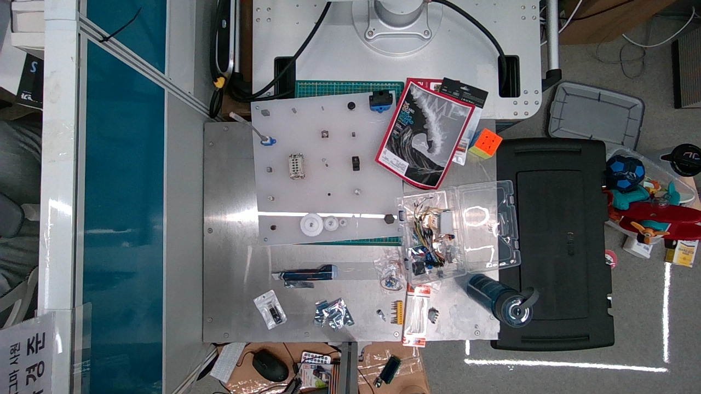
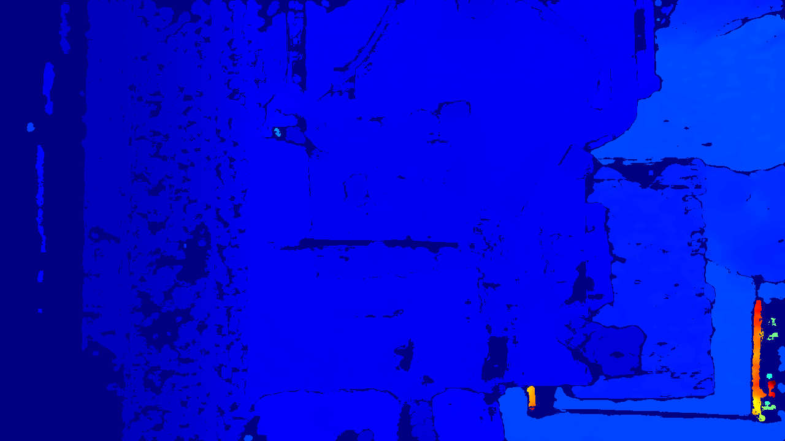

# RealSense Server Project

Intel RealSense 카메라를 위한 다양한 스트리밍 서버 구현체들의 모음입니다.

## 📸 프로젝트 스크린샷

### 컬러 스트림 예시


### 깊이 스트림 예시


## 📁 프로젝트 구조

```
RSSERVER/
├── main.py                    # 기본 RealSense 스트리밍 서버 (FastAPI)
├── simple_server_v1.py        # 고급 기능이 포함된 서버 (WebSocket 지원)
├── simple_server.py           # 간단한 스트리밍 서버
├── check_device.py            # RealSense 장치 검사 및 테스트
├── test.py                    # RealSense 장치 목록 출력
├── requirements.txt           # Python 의존성 패키지
├── temp_pointcloud.ply        # 포인트 클라우드 데이터 (임시)
├── images/                    # 캡처된 이미지 저장 폴더
├── static/                    # 정적 파일 (CSS, JS 등)
├── RSserverV2/                # 서버 버전 2 (구조화된 프로젝트)
├── SimpleServerV2/            # 간단한 서버 버전 2 (모듈화)
├── RSServerV3/                # 서버 버전 3 (최신 구현)
├── RSStreamServer/            # 스트리밍 전용 서버
├── myenv/                     # Python 가상환경
└── myenv2/                    # Python 가상환경 2
```

## 🚀 주요 기능

### 1. 기본 스트리밍 서버 (`main.py`)
- **기능**: 컬러, 깊이, 포인트 클라우드 스트리밍
- **엔드포인트**:
  - `/` - 메인 페이지
  - `/color` - 컬러 스트림
  - `/depth` - 깊이 스트림
  - `/pointcloud` - 포인트 클라우드 다운로드
- **해상도**: 640x480, 30fps

### 2. 고급 스트리밍 서버 (`simple_server_v1.py`)
- **기능**: WebSocket 지원, 다양한 스트림 형식
- **엔드포인트**:
  - `/color`, `/depth` - JPEG 스트림
  - `/color_raw`, `/depth_raw` - 원본 데이터
  - `/ws/color_jpeg`, `/ws/depth_jpeg` - WebSocket JPEG
  - `/ws/color_raw`, `/ws/depth_raw` - WebSocket 원본 데이터
- **해상도**: 1280x720, 30fps

### 3. 장치 검사 도구 (`check_device.py`)
- **기능**: RealSense 카메라 연결 상태 확인
- **출력**: 장치 정보, USB 정보, 테스트 이미지 저장
- **저장**: `images/` 폴더에 컬러/깊이 이미지 자동 저장

### 4. 장치 목록 도구 (`test.py`)
- **기능**: 연결된 RealSense 장치들의 기본 정보 출력
- **정보**: 모델명, 시리얼 번호, 펌웨어 버전, USB 타입

## 📦 설치 및 실행

### ⚠️ **중요: 권장 환경**
- **가상환경**: `myenv2` 사용을 권장합니다
- **서버**: `SimpleServerV2` 사용을 권장합니다 (가장 안정적이고 모듈화된 버전)

### 1. 가상환경 활성화 및 의존성 설치

#### myenv2 가상환경 사용 (권장)
```bash
# myenv2 가상환경 활성화
source myenv2/bin/activate

# 의존성 설치
pip install -r requirements.txt
```

### 2. RealSense 카메라 연결 확인
```bash
python check_device.py
```

### 3. 서버 실행

#### ⭐ SimpleServerV2 실행 (권장)
```bash
cd SimpleServerV2
python simple_server_v2.py
```
- 접속: http://localhost:8000
- **특징**: 모듈화된 구조, 안정적인 성능, 설정 파일 지원

#### 기본 서버 실행
```bash
python main.py
```
- 접속: http://localhost:8000

#### 고급 서버 실행
```bash
python simple_server_v1.py
```
- 접속: http://localhost:8000

#### 장치 목록 확인
```bash
python test.py
```

## 🔧 설정

### SimpleServerV2 설정 (권장)
`SimpleServerV2/camera_config.json` 파일에서 카메라 설정을 조정할 수 있습니다:
```json
{
  "color_width": 1280,
  "color_height": 720,
  "depth_width": 1280,
  "depth_height": 720,
  "fps": 30
}
```

### 카메라 설정
- **해상도**: 640x480 (기본) 또는 1280x720 (고급)
- **프레임레이트**: 30fps
- **포맷**: 
  - 컬러: BGR8
  - 깊이: Z16

### 서버 설정
- **호스트**: 0.0.0.0 (모든 인터페이스)
- **포트**: 8000
- **스레드**: 백그라운드 프레임 캡처

## 📊 API 엔드포인트

### 기본 서버 (`main.py`)
| 엔드포인트 | 메서드 | 설명 |
|-----------|--------|------|
| `/` | GET | 메인 페이지 |
| `/color` | GET | 컬러 스트림 (MJPEG) |
| `/depth` | GET | 깊이 스트림 (MJPEG) |
| `/pointcloud` | GET | 포인트 클라우드 다운로드 |

### 고급 서버 (`simple_server_v1.py`)
| 엔드포인트 | 메서드 | 설명 |
|-----------|--------|------|
| `/` | GET | 메인 페이지 |
| `/status` | GET | 서버 상태 확인 |
| `/color` | GET | 컬러 JPEG 스트림 |
| `/depth` | GET | 깊이 JPEG 스트림 |
| `/color_raw` | GET | 컬러 원본 데이터 |
| `/depth_raw` | GET | 깊이 원본 데이터 |
| `/ws/color_jpeg` | WebSocket | 컬러 JPEG WebSocket |
| `/ws/depth_jpeg` | WebSocket | 깊이 JPEG WebSocket |
| `/ws/color_raw` | WebSocket | 컬러 원본 WebSocket |
| `/ws/depth_raw` | WebSocket | 깊이 원본 WebSocket |

## 🛠️ 개발 환경

### Python 버전
- Python 3.7+

### 주요 라이브러리
- `pyrealsense2` - Intel RealSense SDK
- `fastapi` - 웹 프레임워크
- `uvicorn` - ASGI 서버
- `numpy` - 수치 계산
- `opencv-python` - 이미지 처리
- `websockets` - WebSocket 지원

### 가상환경
프로젝트에는 두 개의 가상환경이 포함되어 있습니다:
- `myenv/` - 기본 가상환경
- `myenv2/` - 추가 가상환경

## 🔍 문제 해결

### 카메라가 인식되지 않는 경우
1. USB 연결 확인
2. RealSense SDK 설치 확인
3. `python check_device.py` 실행하여 장치 상태 확인

### 스트리밍이 끊어지는 경우
1. USB 3.0 포트 사용 확인
2. 다른 USB 장치와의 충돌 확인
3. 카메라 펌웨어 업데이트

### 성능 문제
1. 해상도 낮추기 (640x480 사용)
2. 프레임레이트 조정
3. 다른 프로세스 종료

## 📝 버전 정보

- **RSserverV2/**: 구조화된 프로젝트 버전
- **SimpleServerV2/**: 모듈화된 간단한 서버
- **RSServerV3/**: 최신 구현체
- **RSStreamServer/**: 스트리밍 전용 서버

## 🤝 기여

이 프로젝트는 Intel RealSense 카메라를 위한 다양한 스트리밍 서버 구현체들을 제공합니다. 각 버전은 서로 다른 사용 사례와 요구사항을 위해 개발되었습니다.

## 📄 라이선스

이 프로젝트는 교육 및 연구 목적으로 개발되었습니다. 